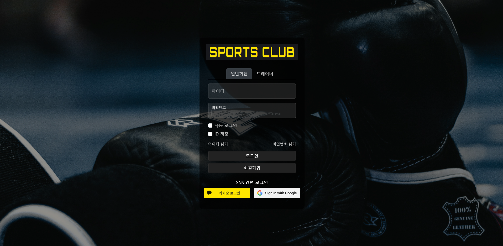
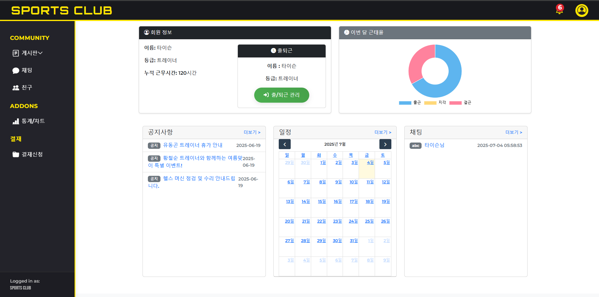

# 🏋️‍♂️ 스포츠클럽 그룹웨어 시스템 (Sports Club Groupware)

**Tech Stack**: Spring Boot + MyBatis + MariaDB + JSP

---

## 📌 프로젝트 개요

스포츠센터의 운영 효율을 높이기 위한 **내부 전용 그룹웨어 시스템**입니다.  
관리자와 트레이너(일반 회원) 간의 업무 흐름을 전자화하고, 근태 및 일정 관리, 전자결재, 비품 처리 등의 다양한 기능을 제공합니다.

---

## 🎯 주요 기능

### 공통
- 로그인 / 로그아웃 / 마이페이지
- 쿠키 기반 자동 로그인 (아이디 저장 포함)
- Spring Security 기반 인증 및 권한 분리
- 알림(Notification) 기능 (전자결재, 비품 처리 등 이벤트 기반)
- 감사기록(Audit Log) 저장

### 🧑‍💼 관리자 기능
- 근태 관리 (출근/퇴근 기록 및 통계)
- 수업 일정 등록 (회원이 예약 가능)
- 전자결재 승인 및 요청 현황 관리
- 비품 고장 신고 접수 및 처리
- 부서 관리
- 통계 차트 시각화 (근태율, 휴가율 등)

### 🧑‍🏫 트레이너 / 일반 회원 기능
- 출퇴근 체크 (출근/퇴근)
- 수업 일정 예약 및 조회
- 비품 고장 신고
- 전자결재 요청
- 게시판 열람 및 작성

---

## 🛠 기술 스택

| 분류       | 기술                                                                 |
|------------|----------------------------------------------------------------------|
| Backend    | Java 17, Spring Boot 4.x, MyBatis                                    |
| Frontend   | JSP, HTML5, CSS3, JavaScript                                         |
| Database   | MariaDB                                                              |
| Template   | JSP + JSTL                                                           |
| 보안       | Spring Security, BCrypt 암호화                                       |
| 기타       | 쿠키 기반 자동 로그인, Ajax, Chart.js, FullCalendar, Bootstrap 5     |

---

## 🗂 프로젝트 구조

<pre>
📁 src/
├── 📁 main/
│ ├── 📁 java/
│ │ └── com.spring.app/
│ │ ├── approval/ # 전자결재
│ │ ├── attendance/ # 근태관리
│ │ ├── auditLog/ # 감사기록
│ │ ├── board/ # 게시판
│ │ │ ├── comment/
│ │ │ ├── interaction/
│ │ │ ├── notice/
│ │ │ └── qna/
│ │ ├── chart/ # 통계 차트
│ │ ├── chat/ # 채팅
│ │ ├── equipment/ # 비품 신고/처리
│ │ ├── exception/ # 예외 처리
│ │ ├── facility/ # 시설 관련
│ │ ├── files/ # 파일 업로드
│ │ ├── home/
│ │ │ └── util/ # 공통 유틸
│ │ ├── interceptor/ # 인터셉터
│ │ ├── payment/ # 결제
│ │ ├── reservation/ # 예약
│ │ ├── schedule/ # 일정
│ │ ├── security/ # Spring Security 설정
│ │ │ ├── jwt/
│ │ │ └── social/
│ │ ├── subscript/ # 구독
│ │ ├── user/ # 사용자
│ │ │ └── friend/ # 친구 관리
│ │ └── websocket/ # WebSocket 채팅
│
├── 📁 resources/
│ ├── mapper/ # MyBatis 매퍼
│ └── application.properties # 환경 설정
│
├── 📁 webapp/
│ └── WEB-INF/
│ └── views/ # JSP 화면
│ ├── approval/
│ ├── attendance/
│ ├── auditLog/
│ ├── board/
│ └── ... 기타 모듈 JSP
</pre>

---

## 📸 데모 스크린샷

<table>
  <tr>
    <td></td>
    <td></td>
  </tr>
</table>

---

## 🔒 보안

- Spring Security를 통한 역할 기반 권한 관리 (관리자 / 트레이너 구분)
- 비밀번호 BCrypt 암호화
- 마이페이지에서 비밀번호 변경 가능
- 자동 로그인 쿠키 유효성 검증
